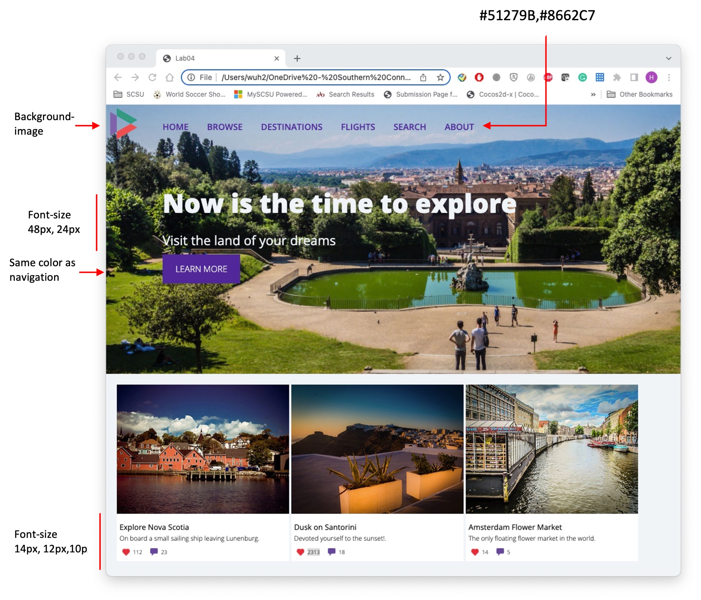

# CSC443 Quiz 1

## Instructions

In this quiz, you will make use of your knowledge of CSS and BS5 to create a sample home page with navigation, large hero image, and three "card" boxes.

#### Completed Quiz-1

## Requirements:

1. Examine quiz-1.html in a browser and then in the VS Code. 
1. Edit the file quiz-1.css by defining styles so that it looks similar to that shown in [Figure](#completed-quiz-1). The steps below provide more details. 
1. The `<header>` will contain a `background-image`. Set its `background-size` to `cover`. Set the $width$ of the `<header>` to `100%` and its `min-height` to `500px`.
1. Add the logo in the top-left corner as a `background-image` to the `<nav>` element. Set its size to about 60px. The $padding$ and `height` of the `<nav>` will also have to be set based on the size of the logo.
1. For each list item in the `<nav>` element, remove the list bullets by setting the `list-style-type` to `none`. Make the list horizontal by setting the display property of each `<li>` to `inline-block`. Set the link, visited, and hover colors of the navigation links. 
1. Set the margin of the `
` within the `<header>` to position it roughly in the vertical middle of the big photo. Set its left margin so it is aligned with the navigation.

1. The card `
` elements need to be on a single line, so set the `display` property of each card to `inline-block`. For the `
` within the card (and its contents), set their `padding` and `margins` to get a similar appearance as [Figure](#completed-quiz-1).

1. For the heart and comment `` elements, use the `background-image, background-size, padding, and margin` properties to get a similar appearance as [Figure](#completed-quiz-1)

1. You can also use BS5 for the styling. 

